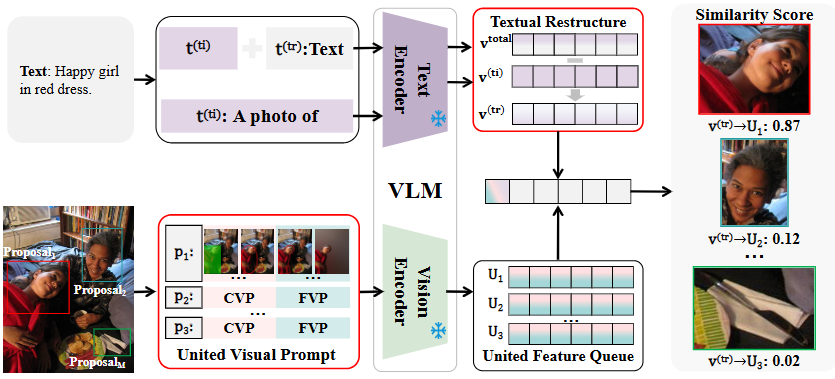

# Multimodal Semantic Decoupled Prompting for Zero-Shot Referring Expression Comprehension (ECAI 2025)

This repo is the official implementation of ECAI 2025 paper: Multimodal Semantic Decoupled Prompting for Zero-Shot Referring Expression Comprehension

> Multimodal Semantic Decoupled Prompting for Zero-Shot Referring Expression Comprehension
>
> Yuxuan Zhang, Longfei Huang, Yang Yang

**Key words: Vision-language model, Zero-shot learning .**

## 📰 News

- **[2025.07.11]** **MSDP** has been accepted by **ECAI 2025**! 🎉

## ✨ Motivation

### **What is the challenging problem for zero-shot REC?**

Large-scale Vision-Language Models~(VLMs) have demonstrated impressive zero-shot performance in sample-level downstream tasks~(e.g., image classification), driven by their powerful generalization ability. However, they still struggle in **instance-level tasks, e.g., zero-shot Referring Expression Comprehension~(REC)**, which requires precisely locating the target instance in an image based on a provided text caption.

## 📖 Overview

### **What do we do to overcome current problem?**



 we propose Multimodal Semantic Decoupled Prompting~(MSDP), a simple yet effective prompt engineering approach that contains both textual- and visual-focused instance-level understanding prompting. Specifically, we first propose a novel **textual restructure strategy** to eliminate the impact of task-irrelevant semantic information, steering the model's attention at the textual understanding level. Meanwhile, we design a **united visual prompt** at the visual understanding level that maximally activates the instance-level understanding capabilities of VLMs.

Experiments on several benchmarks reveal the proposed approach outperforms state-of-the-art~(SOTA) methods.

## 🚀 Quick Start

## Requirement

* Pip packages:

  > pip install -r requirements.txt
  >

### Data Preparation

This repository needs RefCOCO, RefCOCO+, and RefCOCOg. All datasets are supposed to be under ./data.

### Inference

The training script is in `Local-Prompt/scripts/train.sh`, you can alter the parameters in the script file.

e.g., 4-shot training with ViT-B/16

```

CUDA_VISIBLE_DEVICES=0 sh scripts/train.sh data imagenet vit_b16_ep30 end 16 4 True 5 0.5 50

```

## 📘 Citation

If you find this work useful, consider giving this repository a star ⭐️ and citing 📑 our paper as follows:

```bibtex

@inproceedings{zhang2025msdp,

  title={Multimodal Semantic Decoupled Prompting for Zero-Shot Referring Expression Comprehension},

  author={Yuxuan Zhang and Longfei Huang and Yang Yang},

  booktitle={The 28th European Conference on Artificial Intelligence},

  year={2025},
}

```

## Acknowledgememnt

Our code is built upon [FGVP](https://arxiv.org/abs/2306.04356). The installation instructions and the preparation of datasets are the same as the [FGVP repository](https://github.com/ylingfeng/FGVP?tab=readme-ov-file). Thanks for these great works and open sourcing!

If you find them helpful, please consider citing them as well.
